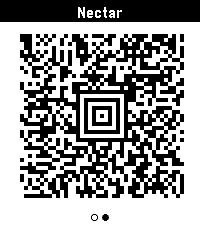

[Core Devices App Store](https://apps.repebble.com/kijete_6a10bbd87d641e0009ce6a58)

[Rebble App Store](https://apps.rebble.io/en_US/application/6a10bbd87d641e0009ce6a58)

kijete
===============

kijete is an app for [Pebble](https://repebble.com/) that allows you to display Code 128, Aztec, Data Matrix, PDF417,
and QR codes on your wrist.

It is a fork of [Skunk](https://github.com/unlobito/skunk) by Harley Watson, and is so named because in toki pona,
a skunk would be described by the word *kijetesantakalu*, or for short, *kijete* or *kije*.

It swaps out a ruby web app for config and barcode generation for a fully client-side JS application.

Its Aztec code support actually works, and it generates codes that are identical to those in my Google Wallet,
unlike Skunk, which is generally a desirable trait.
It is using the [2D-Barcode](https://github.com/zingl/2D-Barcode) library.
